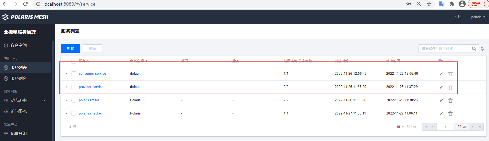
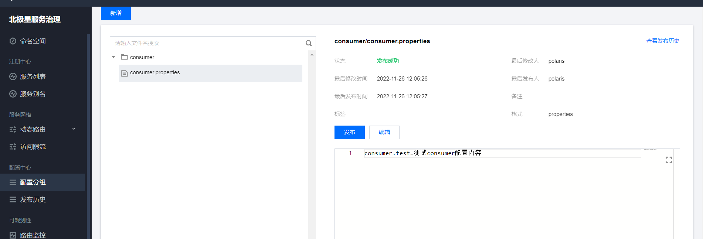
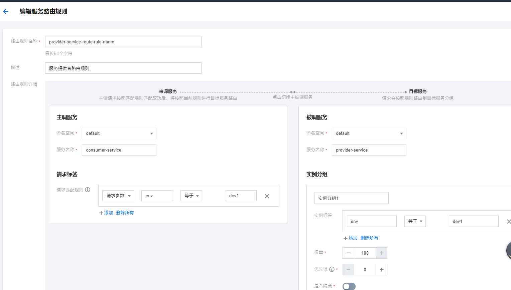
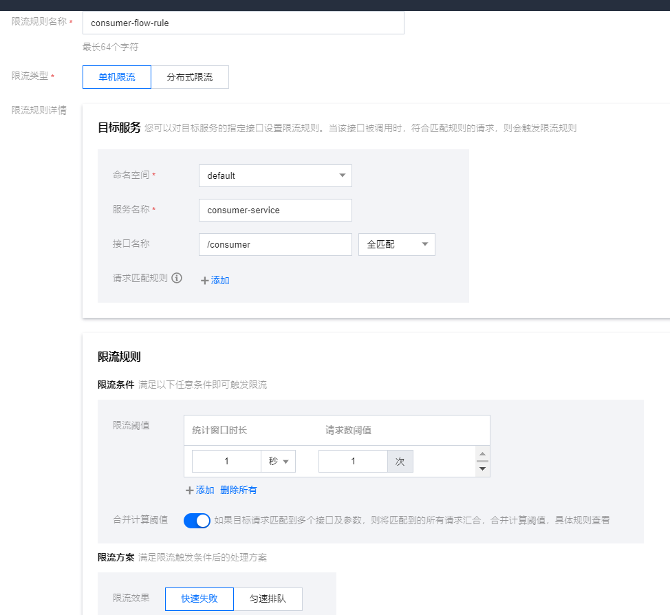
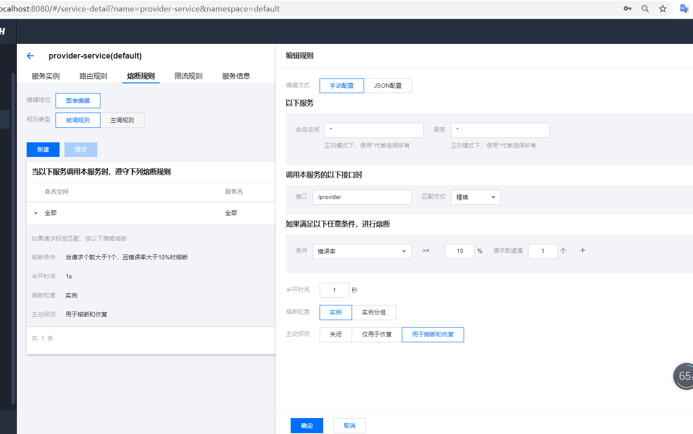

# 一.安装 Polaris 服务端

安装文档地址：[https://polarismesh.cn/docs/使用指南/服务端安装](https://polarismesh.cn/docs/使用指南/服务端安装)

# 二.provider服务

添加服务注册与发现依赖。
启动两个实例，如果服务调用者consumer服务使用到 `动态路由` 组件，需要追加 `spring.cloud.tencent.metadata.content.env` 参数，
provider服务两个实例完整启动参数分别添加：
- `-Dserver.port=7011 -Dspring.cloud.polaris.stat.port=28081 -Dspring.cloud.tencent.metadata.content.env=dev1`，
- `-Dserver.port=7012 -Dspring.cloud.polaris.stat.port=28082 -Dspring.cloud.tencent.metadata.content.env=dev2`

# 三.consumer服务

#### 1.服务注册与发现
添加服务注册与发现依赖，
启动服务之后在控制台可看到自己注册的provider和consumer两个服务


使用Fegin或RestTemplate通过consumer服务调用provider服务，当provider服务下线后，consumer服务依然能够调用到provider服务，
该机制是客户端会缓存一份服务提供者的实例信息，且没有设置可以关闭掉该机制，个人认为是不太友好的实现。

#### 2.配置中心
添加配置中心依赖，
选择命名空间，添加配置分组`consumer-service`, 在配置分组里面添加配置文件`consumer/consumer.properties`


通过 `@Value` 注解能够实现读取到远端的配置，且可不使用 `@RefreshScope` 注解即可达到配置自动刷新的目的。
`PolarisRefreshAffectedContextRefresher` 类实现只刷新受影响的有 `@Value` 注解字段的bean，
`AffectedConfigurationPropertiesRebinder` 类实现只刷新受影响的 `@ConfigurationProperties` 注解类。
如果想使用传统的刷新所有，可通过 `spring.cloud.polaris.config.refresh-type=refresh_context` 配置设置即可。

#### 3.动态路由
服务调用者添加动态路由依赖，
控制台新建路由规则 `provider-service-route-rule-name`，编辑服务路由规则


请求 http://localhost:7022/consumer?env=dev1，
当env等于dev1的时候流量只会打到provider服务端口号为7011的实例上， 当env等于其他值的时候流量会打到provider服务所有的实例上。

#### 4.服务限流
添加服务限流依赖，哪个服务的接口需要限流就在哪个服务添加，
控制台新建限流规则 `consumer-flow-rule`，编辑服务限流规则。此方式为单机限流。


请求 http://localhost:7022/consumer?env=dev1 接口，访问过快会返回：
`The request is denied by rate limit because the throttling threshold is reached`
可通过 `spring.cloud.polaris.ratelimit.rejectRequestTips` 配置自定义返回信息。

- servlet环境下可扩展 `QuotaCheckServletFilter` 类进行扩展自定义返回信息，
- reactive环境下可扩展 `QuotaCheckReactiveFilter` 类进行扩展自定义返回信息。

#### 5.服务熔断
服务调用者添加服务熔断依赖，
控制台在服务提供者provider服务里面配置熔断规则


服务提供者接口模拟异常，
服务提供者7011实例启动参数：-Dspring.cloud.tencent.metadata.content.env=dev1，
服务提供者7012实例启动参数：-Dspring.cloud.tencent.metadata.content.env=dev2，
当该接口参数env等于启动服务提供者启动参数配置的值的时候抛出异常。
```java
@RequestMapping("provider")
public String provider(String env) {
    if (System.getProperty("spring.cloud.tencent.metadata.content.env").equals(env)) {
    throw new RuntimeException("env等于dev1时手动抛出异常测试服务熔断");
    }
    
    Integer serverPort = environment.getProperty("server.port", Integer.class);
    String result = System.currentTimeMillis() + " " + env + " " + serverPort;
    System.out.println(result);
    return result;
}
```

http://localhost:7022/consumer?env=dev2
使用服务调用者发起请求调用服务提供者， 传过去参数env等于dev2，也就是服务提供者7011端口号为正常请求，
服务提供者7012端口为异常请求， 多次调用之后，服务提供者7012出现异常，后面的请求流量都只会打到服务提供者7011实例上面。

# 四.客户端缓存信息

- 服务提供者的信息会缓存在 `polaris/backup/svc#命名空间#服务提供者的服务名称#instance.yaml` 文件里面。
- 配置内容会缓存在 `./polaris/backup/config` 目录下。
- 动态路由的信息会缓存在 `polaris/backup/svc#命名空间#服务提供者的服务名称#routing.yaml` 文件里面。
- 服务限流的信息会缓存在 `polaris/backup/svc#命名空间#服务提供者的服务名称#rate_limiting.yaml` 文件里面。
- 服务东段的信息会缓存在 `polaris/backup/svc#命名空间#服务提供者的服务名称#circuit_breaking.yaml` 文件里面。